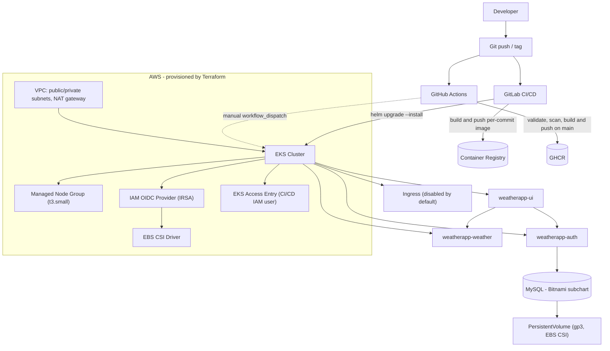

# AWS EKS Microservices Platform


A portfolio project demonstrating how to provision AWS infrastructure with
Terraform and deploy a containerized microservices application to
Kubernetes (EKS) using Helm and CI/CD. Originally built in August 2023 as a
hands-on DevOps exercise and maintained since as a reference implementation
— not a production system, and not presented as one.

## Project Overview

This repository takes a small pre-existing microservices application (Go,
Node.js, Python) and builds a complete, reproducible deployment platform
around it: containerization, AWS infrastructure as code, Kubernetes
manifests, Helm packaging, and CI/CD pipelines (GitLab CI and GitHub
Actions) that validate, scan, build, and deploy on every change. A client
evaluating this repository should be able to conclude: *this person can
take a containerized application and build the AWS/Kubernetes
infrastructure, security tooling, and delivery pipeline around it.*

**What I personally implemented:** the application source code (`auth/`,
`ui/`, `weather/`) is a small pre-existing sample "weather app" (Go module
`github.com/abohmeed/auth`; `ui/package.json` credits Ahmed Elfakharany),
used here as a deployment target. Everything under `terraform/`, `helm/`,
`k8s/`, `.gitlab-ci.yml`, `.github/workflows/`, and the security/dependency
fixes described below is my work.

## What Problem Does This Solve?

Teams often have application code that works locally (or in
`docker-compose`) but no reproducible path to a real cloud environment.
This project shows that path end to end: provision AWS networking and an
EKS cluster with Terraform, package each service as a Helm chart, wire up
secrets/configuration/storage, and automate validate→scan→build→deploy
with CI/CD — so a change to the application code can go from a commit to
a running pod on EKS without manual `kubectl` work.

## Architecture



No backup/disaster-recovery component is shown because none is implemented
in this repository — see [Disaster Recovery](#disaster-recovery-and-backup).

## Technology Stack

| Category | Technologies |
|---|---|
| Cloud | AWS, EKS, EBS, IAM (OIDC/IRSA, EKS Access Entries) |
| Infrastructure as Code | Terraform (variablized, version-pinned) |
| Containers | Docker, Kubernetes |
| Deployment | Helm |
| CI/CD | GitLab CI/CD, GitHub Actions |
| Security tooling | Trivy (image scanning), Gitleaks (secret scanning), hadolint (Dockerfile linting), kubeconform (manifest validation), govulncheck |
| Application | Go, Node.js (Express), Python (Flask), MySQL |

## Infrastructure as Code (Terraform)

`terraform/` provisions AWS networking, the EKS cluster, and the identities
needed to operate it. Configurable values (region, CIDRs, instance type,
node scaling, cluster name, etc.) live in `terraform/variables.tf` with
defaults matching the original deployment — nothing load-bearing is
hardcoded inline anymore. Provider and module versions are pinned
(`required_providers` in `provider.tf`; `terraform-aws-modules/vpc/aws
~> 6.0`). Full breakdown: [`terraform/README.md`](terraform/README.md).

Highlights:
- VPC across two AZs, public/private subnets, single NAT gateway.
- EKS cluster + managed node group (`t3.small`, 1–2 nodes).
- IRSA (OIDC-federated IAM role) for the EBS CSI driver — not node-level
  permissions.
- **Fixed during this pass:** the CI/CD IAM user had no attached policy and
  no EKS access mapping — it could not authenticate to the cluster at all,
  regardless of what Kubernetes RBAC granted. Added `eks:DescribeCluster`
  permission and an `aws_eks_access_entry` mapping the IAM user to the
  Kubernetes username `gitlab`. Authorization still comes entirely from
  `k8s/roles/` — the IAM side only grants authentication.

```bash
cd terraform
terraform init
terraform plan
terraform apply
```

## Kubernetes

Helm charts (below) are the current, documented deployment method. Each
service defines:

- A `Deployment` with configurable `replicaCount` (auth: 4, ui: 4,
  weather: 1) and a non-root `securityContext` (`runAsNonRoot`, dropped
  Linux capabilities, fixed UID).
- Resource `requests`/`limits` (50m/64Mi requests, 250m/256Mi limits by
  default) — starting-point values sized for this small app, not
  benchmarked production numbers, clearly documented as such and
  overridable per environment.
- A `ClusterIP` `Service` and an optional `Ingress` (disabled by default —
  no ingress controller is provisioned here).
- Liveness/readiness probes against each service's actual health endpoint
  (**fixed during this pass:** the UI chart's probes targeted `/`, a route
  behind JWT auth middleware; they were working only incidentally because
  Kubernetes treats HTTP redirects as probe successes. Switched to the
  dedicated `/health` endpoint that already existed in the app code).
- Configuration via environment variables; secrets (DB password, JWT
  signing key, third-party API key) via Kubernetes `Secret` objects.
- An `HorizontalPodAutoscaler` template, disabled by default and left as
  an explicit opt-in.

CI/CD access to the cluster is scoped with a namespace-local `Role`/
`RoleBinding` (`k8s/roles/`), limited to the resource types
`helm upgrade --install` actually touches — not cluster-wide wildcard
access.

The project's original, pre-Helm raw manifests are kept for reference in
[`archive/legacy-k8s-manifests/`](archive/legacy-k8s-manifests/README.md).

## Helm

Helm was chosen so each service is a versioned, parameterized package
instead of static YAML: the same chart deploys to staging or production
with different `--set` values, and `helm upgrade --install` gives
idempotent, rollback-capable deployments from CI.

```
helm/
├── weatherapp-auth/      # Go auth service + MySQL (Bitnami subchart dependency)
├── weatherapp-ui/        # Node/Express UI
└── weatherapp-weather/   # Python/Flask weather API proxy
```

Each chart follows the standard Helm layout, extended with an
application-specific `Secret` template. `weatherapp-auth` declares the
Bitnami `mysql` chart as a dependency, resolved with `helm dependency
build`. All three charts pass `helm lint`, and their rendered output
(including with `ingress`/`autoscaling` enabled) validates against the
Kubernetes API schema via `kubeconform` — see
[Evidence and Validation](#evidence-and-validation).

## CI/CD

`.gitlab-ci.yml` implements a tag-gated promotion pipeline:

| Stage | Trigger | What it does |
|---|---|---|
| `build` | every push (no tag) | Builds all three Docker images |
| `push` | push to `main` | Builds and pushes images tagged with the commit SHA |
| `deliver` | push to `main` | `helm upgrade --install` of all three charts into the `staging` namespace |
| `promote` | git tag | Re-tags and pushes the already-built, already-tested commit-SHA images under the tag |
| `deploy` | git tag, **manual** | `helm upgrade --install` of the tagged images into the production namespace |

`.github/workflows/ci.yml` gives the same pipeline real, visible checks on
GitHub (where this repo is hosted — `.gitlab-ci.yml` never runs there):

| Job | Requires secrets? | What it does |
|---|---|---|
| `secret-scan` | No | Gitleaks scan of the diff/history |
| `dockerfile-lint` | No | hadolint against all three Dockerfiles |
| `helm-lint` | No | `helm lint` + `kubeconform` schema validation of rendered manifests |
| `terraform-validate` | No | `terraform fmt -check`, `init -backend=false`, `validate` |
| `build` | No | Builds each image, scans it with Trivy, uploads results to GitHub's Security tab |
| `push` | No (uses `GITHUB_TOKEN`) | Pushes images to GHCR on `main` |
| `deploy` | Yes (AWS + app secrets) | Manual (`workflow_dispatch`) `helm upgrade --install` to EKS |

The validate/scan jobs need no secrets and run on every push and PR, so
the pipeline shows real, meaningful status without any repository setup.
Only `deploy` needs credentials, and its absence never blocks the rest of
the pipeline from passing.

## Disaster Recovery and Backup

**Not currently demonstrated — recommended future improvement.**

An earlier version of this README described an EBS-snapshot/Velero backup
strategy, but no such implementation exists in this repository: there is
no Velero installation, no backup `CronJob`, no `VolumeSnapshotClass`, and
no AWS Backup Terraform resource. What *does* exist is a `StorageClass`
backed by the EBS CSI driver (`ebs.csi.aws.com`, `gp3`), a prerequisite
for volume snapshotting but not a backup solution by itself.

A real implementation would require, at minimum: a `VolumeSnapshotClass`
and scheduled `VolumeSnapshot`s (or Velero with the AWS/EBS plugin), a
documented and *tested* restore procedure, and a retention/cross-region
copy policy.

## Security Considerations

Two audit passes were run against this repository. Findings and fixes:

| Finding | Fix |
|---|---|
| Hardcoded third-party API key and MySQL password in `docker-compose.yaml`, leaked in git history | Moved to env vars; purged from all 55 commits and 4 tags with `git-filter-repo`, verified with `gitleaks` (0 findings) |
| Hardcoded JWT signing secret in the Go auth service and Node UI service | Now required via `JWT_SECRET`; services fail to start without it |
| CI/CD `Role`/`RoleBinding` granted `apiGroups/resources/verbs: ["*"]` | Scoped to exactly what `helm upgrade --install` needs |
| CI/CD IAM user had no AWS permissions and no EKS access mapping | Added minimal `eks:DescribeCluster` policy + `aws_eks_access_entry` |
| `gin-contrib/cors@v1.3.1` — reachable CVE (GO-2024-2955, wildcard origin mishandling) | Bumped Go dependencies; `govulncheck` now reports **0 reachable vulnerabilities** (down from 28) |
| Flask 2.0.2 (CVE-2023-30861), Flask-Cors 3.0.10 (CVE-2024-6221), urllib3 1.26.20 (multiple) — all HIGH, found by Trivy | Bumped to Flask 3.1.3 / Flask-Cors 6.0.5 / requests 2.34.2; re-scanned, Python-level findings now 0 |
| Weather service ran Flask's built-in dev server in production | Switched to `gunicorn` |
| UI dependencies: 16 known vulnerabilities (1 critical, 11 high) via `npm audit`, including a JWT signature-validation-bypass advisory matching this app's own `jwt.verify()` call | `npm audit fix --force` (axios, jsonwebtoken major bumps) + explicit `algorithms: ["HS256"]` on `jwt.verify()`; **0 vulnerabilities**, re-verified end-to-end (see below) |
| Deprecated in-tree EBS `StorageClass` provisioner | Fixed to `ebs.csi.aws.com` |

Residual, disclosed rather than hidden: Trivy still flags CVEs in the
Debian/Alpine **base-image OS packages** (not app dependencies) for all
three images, and in `npm`'s own bundled CLI tooling inside `node:20-alpine`
(present in the image, never executed at runtime). Fixing these fully
would mean rebuilding on a different/updated base image or moving to a
distroless final stage — listed under Production improvements below
rather than done here, since it adds real complexity for a marginal,
non-reachable finding.

### Production improvements

Not implemented here, and would be required for a production deployment:

- External secrets management (AWS Secrets Manager / External Secrets
  Operator) instead of Helm `--set`-injected Kubernetes `Secret`s.
- CI/CD authentication via IAM OIDC federation instead of a static IAM
  user access key (the OIDC provider already provisioned for IRSA could be
  extended to cover this).
- `NetworkPolicy` resources to restrict pod-to-pod traffic.
- A private EKS API endpoint (currently AWS's default public access).
- Policy enforcement (OPA/Gatekeeper or Kyverno).
- A distroless or npm-stripped final image for the UI service, to remove
  the base-image-bundled npm CLI vulnerabilities noted above.
- Scheduled/Dependabot-driven rebuilds so OS-level base-image CVEs don't
  silently accumulate between Dockerfile changes.

## Evidence and Validation

Every claim above was checked with a real tool run, not just asserted —
this section exists so nothing in this README has to be taken on faith:

| Layer | Tool | Result |
|---|---|---|
| Terraform | `terraform fmt -check`, `validate` | Pass (also confirmed `terraform plan` reaches AWS auth cleanly, no config errors before that point) |
| Helm | `helm lint` (all 3 charts) | Pass |
| Helm rendered output | `kubeconform` (`-strict`, ingress+autoscaling enabled) | 13/7/7 resources valid, 0 invalid |
| Dockerfiles | `hadolint` (all 3) | Pass (`DL3018` explicitly waived — see `.hadolint.yaml` for why) |
| Docker images | `docker build` (all 3) | All build successfully |
| Auth service | `docker run` + DB-unreachable smoke test | Fails fast on missing `JWT_SECRET` as designed |
| Weather service | `docker run` + HTTP request | `/` returns `200` under gunicorn |
| UI service | `docker run` + real JWT sign/verify round-trip | `/health` → `200`; `/` unauthenticated → `302`; `/` with a valid signed cookie → `200` |
| Go dependencies | `govulncheck` | 0 reachable vulnerabilities (was 28) |
| Python dependencies | Trivy (`python-pkg` scope) | 0 findings (was 6 HIGH) |
| Node dependencies | `npm audit` | 0 vulnerabilities (was 16: 1 critical, 11 high, 4 low) |
| Git history | `gitleaks detect` (full history + working tree) | 0 leaks found |

## How to Run

### 1. Prerequisites
AWS account/credentials (`aws configure`), Terraform ≥ 1.5, `kubectl`,
Helm 3, Docker.

### 2. Terraform — provision AWS/EKS
```bash
cd terraform
terraform init
terraform apply   # override defaults with -var, see variables.tf
aws eks update-kubeconfig --name eks-cluster-weather --region eu-west-3
```

### 3. Kubernetes — RBAC for CI/CD
```bash
kubectl create namespace staging
kubectl apply -f k8s/roles/
```

### 4. Helm — deploy the application
```bash
helm repo add bitnami https://charts.bitnami.com/bitnami

cd helm/weatherapp-auth
helm dependency build .
helm upgrade --install weatherapp-auth . \
  --set mysql.auth.rootPassword=<db-password> \
  --set jwtSecret=<jwt-secret>

cd ../weatherapp-ui
helm upgrade --install weatherapp-ui . --set jwtSecret=<jwt-secret>  # must match above

cd ../weatherapp-weather
helm upgrade --install weatherapp-weather . --set apiKey=<rapidapi-key>
```

### 5. CI/CD
- **GitLab:** set `CI_REGISTRY_USER`, `CI_REGISTRY_PASSWORD`, `K8SCONFIG`
  (base64 kubeconfig), `DB_PASSWORD`, `API_KEY` as CI/CD variables.
- **GitHub Actions:** validate/scan/build/push run with no setup; set
  `AWS_ACCESS_KEY_ID`, `AWS_SECRET_ACCESS_KEY`, `AWS_REGION`,
  `DB_PASSWORD`, `JWT_SECRET`, `APIKEY` as repository secrets to enable
  the manual `deploy` job.

### 6. Backup/recovery
Not implemented — see [Disaster Recovery and Backup](#disaster-recovery-and-backup).

## Project Decisions

- **Terraform over the console/CLI**: infrastructure changes are
  reviewable, versioned, and repeatable.
- **EKS over self-managed Kubernetes**: standard choice for AWS-based
  Kubernetes, offloads control-plane operations.
- **Helm over raw manifests**: one parameterized chart per environment
  instead of parallel YAML trees — the project's own history shows this
  evolution (see `archive/legacy-k8s-manifests/`).
- **IRSA for the EBS CSI driver, not node-level IAM**: scopes storage
  permissions to the specific service account that needs them.
- **EKS Access Entries over the legacy aws-auth ConfigMap** for the CI/CD
  IAM user: the modern, Terraform-native way to grant cluster
  authentication, kept separate from Kubernetes-side authorization.
- **GitLab CI as the original pipeline, GitHub Actions added alongside
  it**: the project was originally built against a GitLab remote; GitHub
  Actions was added so the pipeline is visible and runnable on GitHub.
- **Tag-gated promotion**: staging deploys automatically on every push to
  `main`; production requires a git tag and manual approval.
- **Small, honest resource defaults over benchmarked numbers**: shipping
  *some* requests/limits is better practice than the previous empty `{}`,
  but claiming load-tested figures without load-testing would be
  dishonest — so they're explicitly labeled as starting points.

## What This Demonstrates

- AWS infrastructure provisioning (VPC, EKS, IAM/OIDC, access entries,
  managed node groups) with variablized, version-pinned Terraform
- Kubernetes application deployment, RBAC, probes, and resource
  configuration
- Helm chart structure, templating, and dependency management
- CI/CD pipeline design: validation, security scanning, build, staged
  rollout, tag-based promotion
- Docker/containerization: multi-stage builds, non-root runtime users,
  production WSGI server usage
- Practical application security: reachable-vulnerability triage with
  govulncheck/Trivy/npm audit, not just "add a scanner and ignore it"
- Secrets handling via Kubernetes `Secret`s and environment variables,
  with a documented, dated audit trail
- Verification discipline: every infra/security claim backed by an actual
  tool run (see Evidence and Validation)

## Freelance Relevance

Based on the work in this repository, this demonstrates the kind of
project-based infrastructure work I can help with:

- Kubernetes deployment (EKS or otherwise)
- AWS infrastructure provisioning with Terraform
- Helm chart development for existing applications
- CI/CD pipeline implementation (GitLab CI or GitHub Actions)
- Dockerization and container image hardening
- Kubernetes security hardening (RBAC, non-root workloads, secret handling)
- Migrating raw Kubernetes manifests to Helm
- Dependency/vulnerability triage and remediation

This is project-based availability alongside a full-time role — not
on-call, incident response, or 24/7 production support.

## Limitations / What Could Be Extended

Current gaps, stated plainly rather than hidden:

- No disaster-recovery implementation (Velero/snapshots) — see above.
- No automated tests for the application services.
- Secrets flow through Helm `--set` from CI variables, not a dedicated
  secrets manager.
- No `NetworkPolicy`, no OPA/Kyverno policy enforcement.
- EKS API endpoint uses AWS's default public access; no private-endpoint
  configuration.
- No observability stack (metrics/logs/tracing) is deployed — the
  archived `alertmanager.yaml` is a routing-config example only.
- CI/CD to AWS still uses a static IAM user access key rather than OIDC
  federation, despite the OIDC provider already existing for IRSA.
- Base-image OS-level CVEs and npm's own bundled-tooling CVEs remain (see
  Security Considerations) — would need a distroless/rebuild strategy.

For a real client engagement, natural next steps in priority order: GitOps
(ArgoCD/Flux) instead of CI pushing `helm upgrade` imperatively, a tested
backup/restore workflow, OIDC-based CI/CD authentication, and an
observability stack (Prometheus/Grafana) actually wired to real alerting.

## Contact

**Imad EL BOUHATI** — elbouhatiimad@gmail.com
