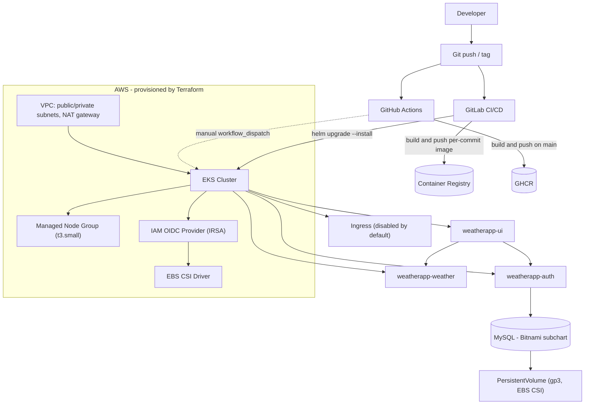

# AWS EKS Microservices Platform


A portfolio project demonstrating how to provision AWS infrastructure with
Terraform and deploy a containerized microservices application to
Kubernetes (EKS) using Helm and CI/CD. Originally built in August 2023 as a
hands-on DevOps exercise and maintained since as a reference implementation
— not a production system.

## Project Overview

This repository takes a small pre-existing microservices application (Go,
Node.js, Python) and builds a complete, reproducible deployment platform
around it: containerization, AWS infrastructure as code, Kubernetes
manifests, Helm packaging, and a CI/CD pipeline that builds, pushes, and
deploys on every change. A client evaluating this repository should be able
to conclude: *this person can take a containerized application and build
the AWS/Kubernetes infrastructure and delivery pipeline around it.*

**Scope note:** the application source code (`auth/`, `ui/`, `weather/`) is
a small sample "weather app" originally published by another developer
(Go module `github.com/abohmeed/auth`; `ui/package.json` credits Ahmed
Elfakharany). It is used here as a deployment target. Everything under
`terraform/`, `helm/`, `k8s/`, `.gitlab-ci.yml`, and
`.github/workflows/ci.yml` — the infrastructure, packaging, and pipeline —
is the work this project demonstrates.

## What Problem Does This Solve?

Teams often have application code that works locally (or in
`docker-compose`) but no reproducible path to a real cloud environment.
This project shows that path end to end: provision AWS networking and an
EKS cluster with Terraform, package each service as a Helm chart, wire up
secrets/configuration/storage, and automate build-push-deploy with CI/CD —
so a change to the application code can go from a commit to a running pod
on EKS without manual `kubectl` work.

## What I Built

- Three services (`auth`, `ui`, `weather`) containerized with per-service
  Dockerfiles and a local `docker-compose.yaml` for development.
- AWS networking, an EKS cluster, and a managed node group provisioned
  with Terraform, including IAM roles, an OIDC provider, and IRSA for the
  EBS CSI driver.
- A Helm chart per service (`helm/weatherapp-auth`, `helm/weatherapp-ui`,
  `helm/weatherapp-weather`), including a MySQL dependency chart for the
  auth service.
- A CI/CD pipeline (`.gitlab-ci.yml`) that builds and pushes images,
  auto-deploys to a staging namespace, and promotes/deploys tagged
  releases to a production namespace via `helm upgrade --install`.
- A GitHub Actions workflow (`.github/workflows/ci.yml`) mirroring the
  build/lint/deploy stages so the pipeline is visible and runnable
  directly on GitHub.
- Namespace-scoped RBAC for the CI/CD identity, least-privilege rather
  than cluster-admin.

## Architecture



No backup/disaster-recovery component is shown because none is implemented
in this repository — see [Disaster Recovery](#disaster-recovery-and-backup).

## Technology Stack

| Category | Technologies |
|---|---|
| Cloud | AWS, EKS, EBS, IAM (incl. OIDC/IRSA) |
| Infrastructure as Code | Terraform |
| Containers | Docker, Kubernetes |
| Deployment | Helm |
| CI/CD | GitLab CI/CD, GitHub Actions |
| Application | Go, Node.js (Express), Python (Flask), MySQL |

## Infrastructure (Terraform)

`terraform/` provisions:

- **Networking** (`eks.tf`, via the `terraform-aws-modules/vpc/aws`
  module): a VPC (`10.0.0.0/16`) across two availability zones
  (`eu-west-3a`/`eu-west-3b`) with public and private subnets and a single
  NAT gateway.
- **EKS cluster** (`eks.tf`): `aws_eks_cluster` running in the private
  subnets, with a cluster IAM role and the standard
  `AmazonEKSClusterPolicy`/`AmazonEKSServicePolicy` attachments.
- **Managed node group** (`eks.tf`): `t3.small` instances, scaling between
  1 and 2 nodes, with worker-node, CNI, and ECR-read-only policy
  attachments.
- **OIDC/IRSA** (`iam-oidc.tf`, `csi-driver-iam.tf`): an IAM OIDC identity
  provider for the cluster, and a federated IAM role scoped to the
  `ebs-csi-controller-sa` service account.
- **EBS CSI driver** (`csi-driver-addon.tf`): installed as an EKS add-on,
  using the IRSA role above rather than node-level permissions.
- **CI/CD IAM identity** (`eks.tf`, `outputs.tf`): an IAM user and access
  key for the CI/CD pipeline (see [Security Considerations](#security-considerations)
  for the tradeoff this represents).

```bash
cd terraform
terraform init
terraform plan
terraform apply
```

## Kubernetes

The Helm charts (see below) are the current, documented deployment method.
Each service defines:

- A `Deployment` with configurable `replicaCount` (auth: 4, ui: 4,
  weather: 1 by default) and a non-root `securityContext`
  (`runAsNonRoot`, dropped Linux capabilities, fixed UID).
- A `ClusterIP` `Service` and an optional `Ingress` (disabled by default —
  no ingress controller is provisioned by this repository).
- Liveness/readiness HTTP probes against each service's health endpoint.
- Configuration via environment variables; secrets (DB password, JWT
  signing key, third-party API key) via Kubernetes `Secret` objects, never
  hardcoded (see [Security Considerations](#security-considerations)).
- An `HorizontalPodAutoscaler` template, disabled by default
  (`autoscaling.enabled: false`) and left as an explicit opt-in.
- A dedicated `ServiceAccount` per release.

CI/CD access to the cluster is scoped with a namespace-local `Role`/
`RoleBinding` (`k8s/roles/`) limited to the resource types a
`helm upgrade --install` actually touches (Deployments, Services,
ConfigMaps, Secrets, Ingresses, HPAs, ServiceAccounts, Pods/logs) — not
cluster-wide wildcard access.

The project's original, pre-Helm raw manifests are kept for reference in
[`archive/legacy-k8s-manifests/`](archive/legacy-k8s-manifests/README.md).

## Helm

Helm was chosen so each service is a versioned, parameterized package
instead of static YAML: the same chart deploys to staging or production
with different `--set` values (image tag, replica count, secrets), and
`helm upgrade --install` gives idempotent, rollback-capable deployments
from CI.

```
helm/
├── weatherapp-auth/      # Go auth service + MySQL (Bitnami subchart dependency)
├── weatherapp-ui/        # Node/Express UI
└── weatherapp-weather/   # Python/Flask weather API proxy
```

Each chart follows the standard Helm layout (`Chart.yaml`, `values.yaml`,
`templates/`) generated from `helm create` and extended with an
application-specific `Secret` template. `weatherapp-auth` declares the
Bitnami `mysql` chart as a dependency (`Chart.yaml` → `dependencies`),
resolved with `helm dependency build`.

## CI/CD

`.gitlab-ci.yml` implements a tag-gated promotion pipeline:

| Stage | Trigger | What it does |
|---|---|---|
| `build` | every push (no tag) | Builds all three Docker images |
| `push` | push to `main` | Builds and pushes images tagged with the commit SHA |
| `deliver` | push to `main` | `helm upgrade --install` of all three charts into the `staging` namespace |
| `promote` | git tag | Re-tags and pushes the already-built, already-tested commit-SHA images under the tag (promotes a known artifact instead of rebuilding) |
| `deploy` | git tag, **manual** | `helm upgrade --install` of the tagged images into the production namespace |

`.github/workflows/ci.yml` mirrors this for GitHub: `build`, `helm-lint`,
and `terraform-fmt` jobs run automatically on every push/PR with no
secrets required; a `push` job publishes images to GHCR on `main`; a
`deploy` job is manual (`workflow_dispatch`) and requires AWS/DB/JWT/API
secrets to be configured, so its absence never blocks the rest of the
pipeline from passing.

## Disaster Recovery and Backup

**Not currently demonstrated — recommended future improvement.**

An earlier version of this README described an EBS-snapshot/Velero backup
strategy, but no such implementation exists in this repository: there is
no Velero installation, no backup `CronJob`, no `VolumeSnapshotClass`, and
no AWS Backup Terraform resource. What *does* exist is a `StorageClass`
backed by the EBS CSI driver (`ebs.csi.aws.com`, `gp3`), which is a
prerequisite for volume snapshotting but not a backup solution by itself.

A real implementation would require, at minimum:
- A `VolumeSnapshotClass` and scheduled `VolumeSnapshot`s, or Velero with
  the AWS/EBS plugin installed via Helm.
- A documented, tested restore procedure — a backup that has never been
  restored is not a disaster-recovery plan.
- A retention and cross-region/cross-account copy policy for snapshots.

## Security Considerations

An audit of this repository (2026-08) found and fixed the following:

| Finding | Fix |
|---|---|
| Hardcoded third-party API key and MySQL password in `docker-compose.yaml` | Moved to environment variables (`.env.example`) |
| Hardcoded JWT signing secret in the Go auth service and Node UI service | Now required via `JWT_SECRET` env var; services fail to start without it |
| Real API key and MySQL password committed (base64) in Kubernetes `Secret` manifests | Replaced with placeholder values |
| CI/CD `Role`/`RoleBinding` granted `apiGroups: ["*"], resources: ["*"], verbs: ["*"]` | Scoped to the specific resources `helm upgrade --install` needs |
| Terraform IAM access key ID output not marked sensitive | Marked `sensitive = true` |
| Leaked API key present in git history | Purged from all commits |

### Production improvements

Not implemented here, and would be required for a production deployment:

- External secrets management (AWS Secrets Manager / External Secrets
  Operator) instead of Helm `--set`-injected Kubernetes `Secret`s.
- Container image scanning in CI (e.g. Trivy/Grype).
- CI/CD authentication via IAM OIDC federation instead of a long-lived IAM
  user access key (the OIDC provider already provisioned for IRSA in
  `iam-oidc.tf` could be extended to cover this).
- `NetworkPolicy` resources to restrict pod-to-pod traffic.
- A private EKS API endpoint.
- Policy enforcement (OPA/Gatekeeper or Kyverno).
- Resource `requests`/`limits` set to real, workload-tested values (left
  as an explicit opt-in in every chart today).

## Reproducibility

### 1. Prerequisites
- AWS account and credentials configured locally (`aws configure`)
- Terraform >= 1.0
- `kubectl`
- Helm 3
- Docker

### 2. AWS setup
```bash
aws configure --profile default
```
`terraform/provider.tf` uses the `default` AWS profile and the
`eu-west-3` region.

### 3. Terraform — provision AWS/EKS
```bash
cd terraform
terraform init
terraform apply
aws eks update-kubeconfig --name eks-cluster-weather --region eu-west-3
```

### 4. Kubernetes — RBAC for CI/CD
```bash
kubectl create namespace staging
kubectl apply -f k8s/roles/
```

### 5. Helm — deploy the application
```bash
helm repo add bitnami https://charts.bitnami.com/bitnami

cd helm/weatherapp-auth
helm dependency build .
helm upgrade --install weatherapp-auth . \
  --set mysql.auth.rootPassword=<db-password> \
  --set jwtSecret=<jwt-secret>

cd ../weatherapp-ui
helm upgrade --install weatherapp-ui . \
  --set jwtSecret=<jwt-secret>   # must match the value above

cd ../weatherapp-weather
helm upgrade --install weatherapp-weather . \
  --set apiKey=<rapidapi-key>
```

### 6. CI/CD
- **GitLab:** set `CI_REGISTRY_USER`, `CI_REGISTRY_PASSWORD`, `K8SCONFIG`
  (base64-encoded kubeconfig), `DB_PASSWORD`, `API_KEY` as CI/CD variables.
- **GitHub Actions:** set `AWS_ACCESS_KEY_ID`, `AWS_SECRET_ACCESS_KEY`,
  `AWS_REGION`, `DB_PASSWORD`, `JWT_SECRET`, `APIKEY` as repository
  secrets to enable the manual `deploy` job; `build`/`helm-lint`/
  `terraform-fmt`/`push` require no setup.

### 7. Backup/recovery
Not implemented — see [Disaster Recovery and Backup](#disaster-recovery-and-backup).

## Project Decisions

- **Terraform over the console/CLI**: infrastructure changes are
  reviewable, versioned, and repeatable.
- **EKS over self-managed Kubernetes**: offloads control-plane operations,
  standard choice for AWS-based Kubernetes workloads.
- **Helm over raw manifests**: the same chart is reused across
  environments with different `--set` values instead of maintaining
  parallel YAML trees (the project's own history shows this evolution —
  see `archive/legacy-k8s-manifests/`).
- **IRSA for the EBS CSI driver, not node-level IAM**: scopes storage
  permissions to the specific service account that needs them, not every
  pod on the node.
- **GitLab CI as the primary pipeline, with GitHub Actions added
  alongside it**: the project was originally built against a GitLab
  remote; GitHub Actions was added so the pipeline is visible and
  runnable on GitHub, where this repository is hosted.
- **Tag-gated promotion**: `staging` deploys automatically on every push
  to `main`; production deploys require a git tag and a manual approval
  step, rather than deploying every commit straight to production.

## Project Outcome

Built a reproducible workflow for provisioning AWS infrastructure and
deploying a containerized microservices application to Kubernetes, with
CI/CD automation covering build, staging deployment, and gated production
promotion.

## What This Demonstrates

- AWS infrastructure provisioning (VPC, EKS, IAM/OIDC, managed node
  groups) with Terraform
- Kubernetes application deployment and configuration
- Helm chart structure, templating, and dependency management
- CI/CD pipeline design (build, push, staged rollout, tag-based promotion)
- Docker/containerization, including multi-stage builds and non-root
  runtime users
- Kubernetes RBAC scoped to least privilege
- Secrets handling via Kubernetes `Secret`s and environment variables
  (with a documented audit trail of what was fixed)
- Infrastructure and platform documentation

## Freelance Projects I Can Help With

Based on the work in this repository, I can help with project-based
infrastructure work such as:

- Deploying a containerized application to Kubernetes (EKS or otherwise)
- Migrating Docker/Compose workloads to Kubernetes
- Writing and structuring Helm charts for existing applications
- Provisioning AWS infrastructure with Terraform
- Building CI/CD pipelines (GitLab CI or GitHub Actions) for
  container build/push/deploy workflows
- Kubernetes configuration: secrets, RBAC, autoscaling, ingress
- Setting up backup/restore workflows (Velero, EBS snapshots)

This is project-based availability alongside a full-time role — not
on-call, incident response, or 24/7 production support.

## Limitations / Production Hardening

This is a portfolio/lab project, not a production system. Known gaps if
this were taken further:

- No disaster-recovery implementation (see above).
- No automated tests for the application services.
- No image vulnerability scanning in either pipeline.
- Secrets are passed via Helm `--set` from CI variables, not a dedicated
  secrets manager.
- No `NetworkPolicy`, no OPA/Kyverno policy enforcement.
- EKS API endpoint uses AWS's default (public) access; no private-endpoint
  configuration.
- No observability stack (metrics/logs/tracing) is deployed — the
  archived `alertmanager.yaml` is a routing-config example only, not a
  running Prometheus/Alertmanager installation.
- Application dependencies (npm/pip/go modules) have not been audited or
  upgraded as part of this pass; `npm audit` currently reports known
  vulnerabilities in the UI service's dependencies.

## Contact

**Imad EL BOUHATI** — elbouhatiimad@gmail.com
